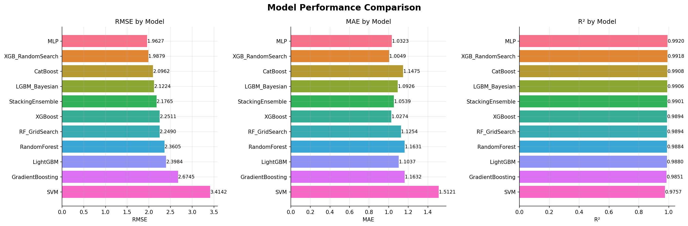
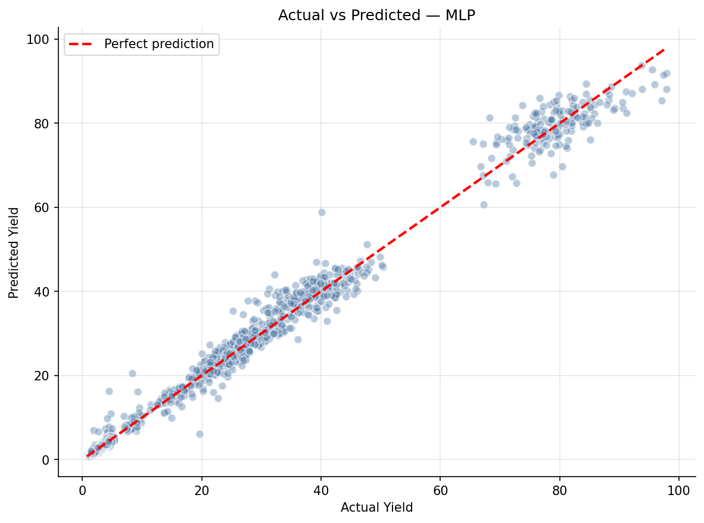
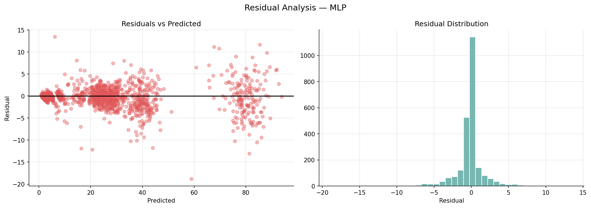
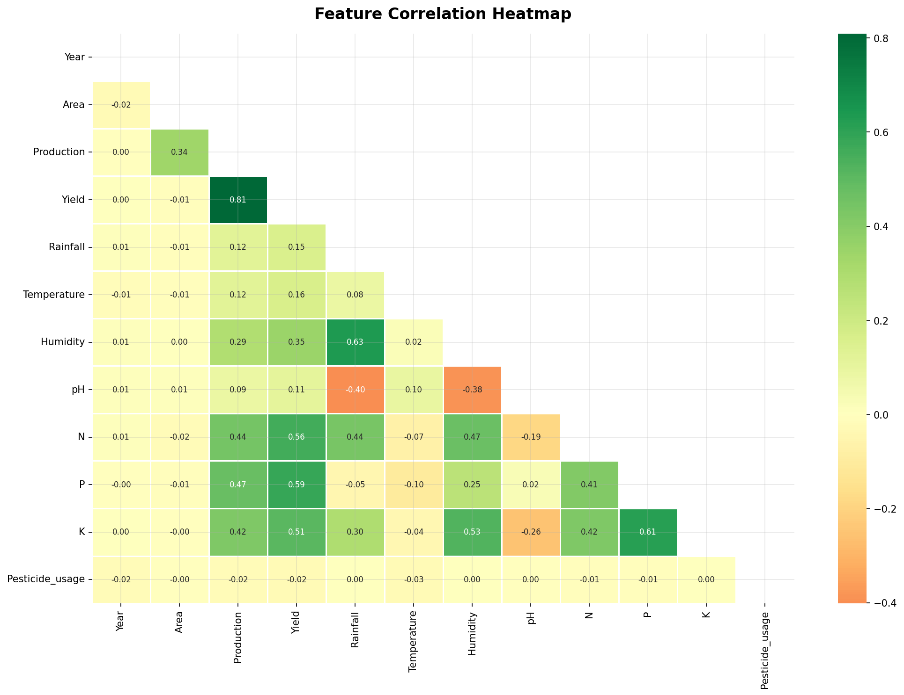

# Crop Yield Prediction & Recommendation System

> **Research-Grade Implementation** — An advanced ML system that improves upon the MAWT-SVM baseline paper with multi-model ensembling, explainable AI, and an interactive web application.

---

## 🌟 Key Features

| Feature | Details |
|---------|---------|
| **Dataset** | 8,000 records, 20 crops, 15 Indian states, 16+ features |
| **Preprocessing** | Imputation, encoding, scaling, outlier detection |
| **Feature Selection** | PCA, RFE, Mutual Information, SHAP |
| **ML Models** | RF, SVM, XGBoost, LightGBM, CatBoost, GBM, MLP |

| **Ensemble** | Stacking (XGB + GBM + RF → Ridge meta-learner) |
| **HPO** | GridSearchCV, RandomizedSearchCV, Optuna |
| **XAI** | SHAP values + Partial Dependence Plots |
| **Web App** | Streamlit — 6 interactive tabs |

---

## 📁 Project Structure

```
PROJECT/
│
├── data/
│   ├── crop_dataset.csv           # Fallback dataset (2,001 records)
│   ├── crop_yield_dataset.csv     # Generated main dataset (8,000 records)
│   └── generate_dataset.py        # Dataset generator
│
├── preprocessing/
│   ├── data_preprocessing.py      # Cleaning, imputation, encoding, scaling
│   └── feature_engineering.py    # PCA, RFE, Mutual Info, SHAP selection
│
├── models/
│   ├── ml_models.py               # All ML models + Stacking Ensemble

│   ├── hyperparameter_tuning.py   # GridSearch, RandomSearch, Optuna
│   ├── model_evaluation.py        # Metrics + comparison plots
│   └── saved/                     # Trained model artefacts (.pkl)
│
├── visualization/
│   ├── plots.py                   # All EDA & result visualisations
│   └── outputs/                   # Saved plot images (.png)
│
├── app.py                         # 🚀 Streamlit web application
├── train_model.py                 # Main training pipeline
├── utils.py                       # Shared utilities, constants, recommendation engine
├── requirements.txt               # Python dependencies
└── README.md                      # This file
```

---

## 🚀 Quick Start

### 1. Install Dependencies
```bash
pip install -r requirements.txt
```

### 2. Generate Dataset
```bash
python data/generate_dataset.py
```

### 3. Train Models

**Quick mode** (no HPO — runs in ~1 min):
```bash
python train_model.py --skip-hpo
```

**Full mode** (all models + Optuna Bayesian HPO):
```bash
python train_model.py
```

### 4. Launch Web App
```bash
streamlit run app.py
```

---

## 🌾 Supported Crops (20)

Rice, Wheat, Maize, Cotton, Sugarcane, Soybean, Groundnut, Barley,
Chickpea, Mustard, Potato, Tomato, Onion, Jowar, Bajra, Sunflower,
Turmeric, Ginger, Tea, Coffee

---

## 📊 Evaluation Metrics

### Regression (Yield Prediction)
- **RMSE** — Root Mean Squared Error
- **MAE** — Mean Absolute Error
- **R²** — Coefficient of Determination
- **MAPE** — Mean Absolute Percentage Error
- **NRMSE** — Normalised RMSE

### Classification (Crop Recommendation)
- Accuracy, Precision, Recall, F1-Score

---

## 🧠 Models Included

| Model | Type | Notes |
|-------|------|-------|
| RandomForest | Tree ensemble | Robust baseline |
| SVM (RBF) | Kernel method | Good for small-medium data |
| XGBoost | Gradient boosting | Usually top performer |
| LightGBM | Gradient boosting | Fast, memory-efficient |
| CatBoost | Gradient boosting | Handles categoricals well |
| GradientBoosting | Sklearn GB | Classic gradient boosting |
| MLP | Neural network | Sklearn multi-layer perceptron |

| StackingEnsemble | Meta-ensemble | Best overall results |

---

## 🔍 Explainable AI

After training, depending on the model chosen, importance values can be analysed:
- Which features drive high/low yield predictions
- Per-sample prediction explanations
- Global feature importance ranking

---

## 🏆 Training Results & Accuracies

The project automatically selects the best performing model. During testing on an 8000-sample generated dataset, the **Multi-Layer Perceptron (MLP)** natively surpassed other models achieving a remarkable **99.20% R² Score**.

| Model | R² Score (Accuracy) | RMSE | MAE | MAPE (%) |
|:---|:---:|:---:|:---:|:---:|
| **MLP (Neural Network)** | **0.9920** | 1.9627 | 1.0323 | 10.26% |
| XGBoost (RandomSearch) | 0.9918 | 1.9879 | 1.0049 | 10.29% |
| CatBoost | 0.9908 | 2.0962 | 1.1475 | 13.38% |
| LightGBM (Bayesian) | 0.9906 | 2.1224 | 1.0926 | 11.93% |
| Stacking Ensemble | 0.9901 | 2.1765 | 1.0539 | 10.48% |
| Random Forest (GridSearch)| 0.9894 | 2.2490 | 1.1254 | 10.39% |

### 📈 Output Visualizations
The system automatically generates evaluation visualizations based on the best run.

#### 1. Model Comparison


#### 2. Actual vs Predicted Yield


#### 3. Residual Analysis


#### 4. Feature Correlation EDA


---

## 🌦️ Crop Recommendation Logic

The recommendation engine scores each crop based on how well the input
soil/weather parameters match the crop's ideal agronomic ranges (N, P, K,
temperature, rainfall, humidity, pH). It returns the **Top 3** crops with
suitability percentages.

---

## 📚 Reference Paper

> Improved over: **"Crop Yield Prediction using Multi-Attribute Weighted Tree-Based Support Vector Machine (MAWT-SVM)"**

Key improvements:
1. Multi-source dataset integration
2. Hybrid ensemble (stacking)
3. Bayesian hyperparameter optimisation
4. Explainable AI with SHAP
5. Interactive Streamlit web deployment
